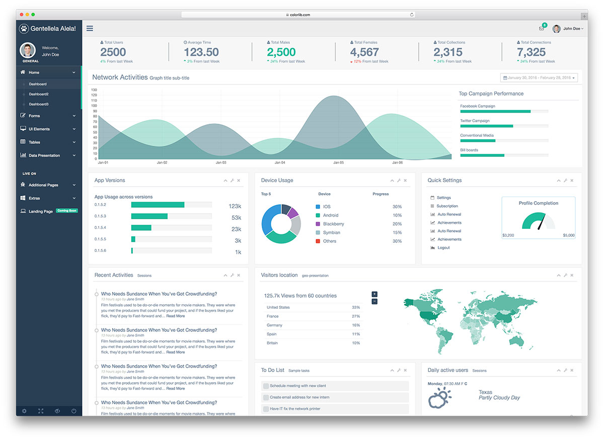

<!-- README.md is generated from README.Rmd. Please edit that file -->

# shiny.gentelella

<!-- badges: start -->

[](https://github.com/bmoretz/shiny.gentelella/actions)
[](https://lifecycle.r-lib.org/articles/stages.html#experimental)
[](https://codecov.io/gh/bmoretz/shiny.gentelella)
<!-- badges: end -->

The goal of shiny.gentelella is to provide a simple, object-oriented
application framework styled using the open-source bootstrap4 theme,
<a href="https://github.com/ColorlibHQ/gentelella">gentelella</a>.

## Installation

You can install the development version of shiny.gentelella like so:

``` r
remotes::install_github("bmoretz/shiny.gentelella")
```

## Example

This is a simple example that shows you how to setup a single page
dashboard:

``` r
library(shiny.gentelella)
#> Loading required package: shiny

ExampleDashboard <- R6::R6Class(
  classname = "ExampleDashboard",
  inherit = Dashboard,
  public = list(

    #' @field meta page attributes
    #' and configuration wrapper.
    meta = list(
      title = "Example Dashbaord",
      nav_definition = system.file("example",
                                   "navigation.yml",
                                   package = "shiny.gentelella")
    ),

    #' @description
    #' Create a new UI Page object.
    #' @return A new `ExampleDashboard` object.
    initialize = function() {
      super$initialize()
    },

    #' @description user-interface wrapper.
    ui = function() {
      self$layout()
    },

    #' @description server-side wrapper.
    #' @param input form input
    #' @param output render output
    #' @param session page session
    server = function(input, output, session) {

      private$set_logging()
      logger::log_trace("processing server events")
    }
  ),
  private = list()
)

example <- ExampleDashboard$new()

# Run the application
app <- shinyApp(ui = example$ui(),
                server = example$server)

# runApp(app, port = 8080)
```


